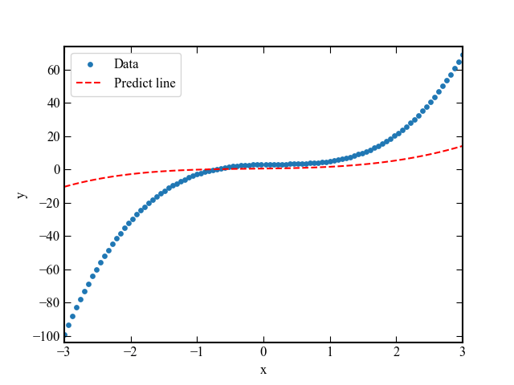

# Regressão Polinomial com SGD e Gerador Pseudoaleatório XORSHIRO

Este projeto implementa uma regressão polinomial cúbica utilizando o algoritmo de Gradiente Descendente Estocástico (SGD) em Python.
Os dados são gerados artificialmente com ruído aleatório produzido por um gerador pseudoaleatório baseado no algoritmo XORSHIRO.

O código também exibe uma animação em tempo real do processo de treinamento do modelo.

---

# Objetivo

Ajustar um polinômio cúbico aos dados gerados pela função:

genui{"math_block_widget_always_prefetch_v2":{"content":"y = 3x^3 - 2x^2 + x + 3"}}

utilizando SGD para aprender os coeficientes:

\hat{y} = ax^3 + bx^2 + cx + d

---

# Bibliotecas Utilizadas

```python
numpy
matplotlib
```

Instalação:

```bash
pip install numpy matplotlib
```

---

# Estrutura do Código

## 1. Configuração do Matplotlib

Define o estilo visual dos gráficos:

* Fonte serifada
* Eixos mais espessos
* Ticks internos
* Legenda ativada

---

## 2. Gerador Pseudoaleatório XORSHIRO

O código implementa um gerador pseudoaleatório baseado no algoritmo XORSHIRO.

Funções principais:

```python
rotl(x, k)
```

Realiza rotação de bits.

```python
next_xorshiro()
```

Gera o próximo número pseudoaleatório de 64 bits.

```python
rand_uniform()
```

Converte o valor gerado em um número de ponto flutuante no intervalo:

[0,1)

---

# Geração dos Dados

Os dados são gerados no intervalo:

x \in [-3,3]

com:

```python
x = np.linspace(-3,3,100)
```

A função verdadeira é:

```python
y = 3*x**3 - 2*x**2 + x + 3
```

Adiciona-se ruído aleatório:

```python
y += rand_uniform()
```

---

# Inicialização dos Parâmetros

Os coeficientes do modelo são inicializados aleatoriamente:

```python
a,b,c,d = rand_uniform(),rand_uniform(),rand_uniform(),rand_uniform()
```

---

# Treinamento com SGD

O treinamento utiliza:

* Learning rate:

\eta = 5 \times 10^{-4}

* Número de épocas:

```python
epchs = 20
```

---

# Função de Erro

O erro é calculado por:

error = y - \hat{y}

---

# Atualização dos Parâmetros

Os gradientes utilizados são:

\frac{\partial L}{\partial a} = -2x^3(error)

\frac{\partial L}{\partial b} = -2x^2(error)

\frac{\partial L}{\partial c} = -2x(error)

\frac{\partial L}{\partial d} = -2(error)

Atualização:

\theta = \theta - \eta \nabla L

---

# Visualização

Durante o treinamento o gráfico é atualizado em tempo real mostrando:

* Pontos dos dados originais
* Curva prevista pelo modelo

<p align="center">
  
</p>

---

# Como Executar

Salve o código em um arquivo:

```bash
main.py
```

Execute:

```bash
python main.py
```

---

# Resultado Esperado

Ao longo das épocas, a curva prevista deve convergir para a função original:

genui{"math_block_widget_always_prefetch_v2":{"content":"y = 3x^3 - 2x^2 + x + 3"}}

reduzindo progressivamente o erro entre os dados e a predição.

---

# Conceitos Envolvidos

* Regressão polinomial
* Gradiente descendente estocástico (SGD)
* Ajuste de curvas
* Geradores pseudoaleatórios
* XORSHIRO
* Visualização dinâmica com Matplotlib
* Otimização numérica

---

# Possíveis Melhorias

* Implementar função de custo MSE
* Salvar a animação em GIF ou MP4
* Adicionar minibatch gradient descent
* Comparar com NumPy Polynomial Fit
* Implementar Adam Optimizer
* Adicionar métricas de erro
* Usar ruído gaussiano realista

---

# Autor

Projeto desenvolvido para estudo de:

* Machine Learning
* Métodos Numéricos
* Regressão Polinomial
* Otimização com SGD
* Visualização computacional em Python
